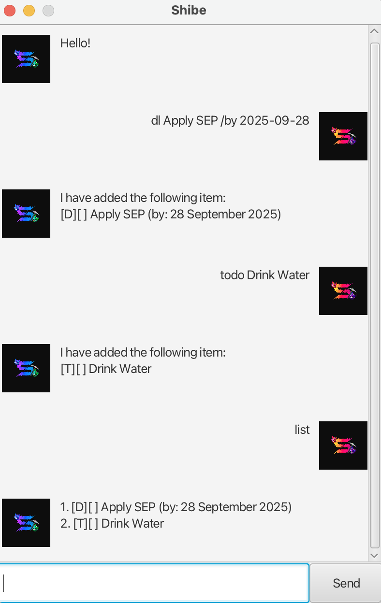

# 🐶 Shibe User Guide



---

**Shibe** is a simple, intuitive command-line and GUI-based task manager. It helps you keep track of your todos, deadlines, and events with easy-to-use commands.

---

## 📋 Commands

### ➕ Add a Todo

Add a simple todo task.

```sh
todo eat
```

**Expected output:**

```
I have added the following item:
[T][ ] eat
```

---

### ⏰ Add a Deadline

Add a task that must be completed by a certain date.

```sh
deadline submit assignment /by 2025-12-12
```

**Expected output:**

```
I have added the following item:
[D][ ] submit assignment (by: 12 December 2025)
```

---

### 📅 Add an Event

Add an event with a start and end date.

```sh
event project meeting /from 2025-12-12 /to 2025-12-13
```

**Expected output:**

```
I have added the following item:
[E][ ] project meeting (from: 12 December 2025 to 13 December 2025)
```

---

### 📃 List All Items

View all your current tasks.

```sh
list
```

**Expected output:**

```
1. [T][ ] eat
2. [D][ ] drink (by: 12 December 2025)
3. [E][ ] drink (from: 12 December 2025 to 13 December 2025)
```

---

### ✅ Mark Item as Done

Mark a task as completed.

```sh
do drink
```

**Expected output:**

```
You have completed the following item:
[D][X] drink (by: 12 December 2025)
```

---

### ❌ Delete an Item

Delete a task by its index.

```sh
delete 1
```

**Expected output:**

```
The following item was deleted:
[T][ ] eat
```

---

### 🔍 Find Items

Search for tasks containing a keyword.

```sh
find drink
```

**Expected output:**

```
Here are the items that matched your item name:
1. [D][X] drink (by: 12 December 2025)
2. [E][ ] drink (from: 12 December 2025 to 13 December 2025)
```

---

### 👋 Exit

Exit Shibe.

```sh
bye
```

**Expected output:**

```
Bye. Hope to see you again soon!
```
